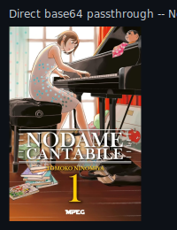
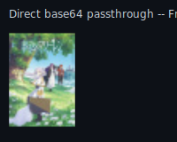
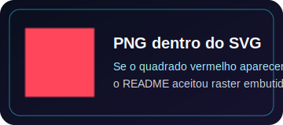

# Direct base64 passthrough test (no Photon, no Sharp, no cache)

Minimal pipeline under test: `fetch(url)` → `ArrayBuffer` → base64 of the **exact same
bytes** → `data:` URI → embedded directly in an SVG `<image>`. No decode, no resize,
no re-encode, no format conversion, nothing written to disk/R2/KV/Cache API.

Every image below was fetched **fresh from its origin** for this test (not copied from
any earlier fixture's base64) via an isolated, temporary Cloudflare Worker
(`weeb-direct-base64-tmp`, deleted after this test). SHA-256 of the HTTP response bytes
was verified to match the SHA-256 of the bytes decoded back out of the generated base64
string, for every image.

## Nodame Cantabile (single image, user-provided URL)

## Frieren (the cover that broke in the earlier Photon-thumbnail investigation)

`small_image_url` re-fetched fresh from `cdn.myanimelist.net` (not the base64 from the
earlier fixture). Same bytes, same SHA-256, base64'd directly, no Photon involved at all.

## Four real MAL covers

Frieren, Fullmetal Alchemist: Brotherhood, Steins;Gate, Shingeki no Kyojin —
`small_image_url` for all four, same 75×120 layout as the earlier comparison fixtures.

## Known-good control (PNG-in-SVG, from an earlier, already-validated test)

## What this answers

If all four images above render correctly (no broken-image icon) in this page as
rendered by GitHub, including Frieren, then the passthrough pipeline itself is not the
cause of any prior rendering failure -- see the accompanying engineering report for the
full byte-identity table, benchmark numbers, and the root-cause conclusion for Frieren
specifically.
