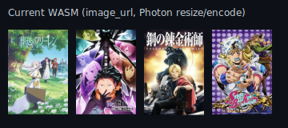

# MAL image pipeline comparison (visual test fixture)

Same 4 real MyAnimeList covers, same layout (75×120), two different embedding
pipelines. Both files are plain SVG with `<image href="data:image/jpeg;base64,...">`
— no external URLs, no PNG-vs-SVG format change.

**Current WASM** — `mal-current-images.svg`
`image_url` source (225×335) → Photon (WASM) decode/resize/encode to fit 200×200 → base64.

**Direct thumbnail** — `mal-thumbnail-images.svg`
`small_image_url` source (50×74 native) → raw JPEG bytes → base64 directly, no decode/resize/Photon.

## Why this exists

Benchmarked on isolated Cloudflare Workers (not production): the current pipeline's
Photon (WASM) resize/encode step costs ~100ms CPU (P50) for 10 images, vs ~3.7ms CPU
for direct thumbnail passthrough (no WASM) — about 27x. The open question this
fixture answers is purely visual: is the small (50×74) thumbnail, upscaled to the
75×120 display size, sharp enough to use directly instead of paying the WASM cost.
