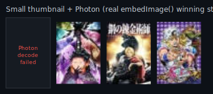

# MAL image pipeline comparison (visual test fixture)

Same 4 real MyAnimeList covers, same layout (75×120), three embedding pipelines.
All files are plain SVG with `<image href="data:image/jpeg;base64,...">` — no
external URLs, no PNG-vs-SVG format change.

**Current WASM (large source)** — `mal-current-images.svg`
`image_url` source (225×335) → Photon (WASM) decode/resize/encode to fit 200×200 → base64.

**Direct thumbnail (no Photon)** — `mal-thumbnail-images.svg`
`small_image_url` source (50×74 native) → raw JPEG bytes → base64 directly, no decode/resize/Photon.

**Small thumbnail + Photon (winning strategy, actually implemented in `embedImage()`)** — `mal-thumbnail-photon-images.svg`
`small_image_url` source (50×74 native) → Photon decode/resize/re-encode to 75×120 JPEG → base64.
Uses the exact same source bytes as the row above — the only variable is whether Photon
processes them. One cover (Frieren) fails to decode in Photon even from this identical
source and is shown as a labeled empty slot rather than a broken image icon; see below.

## Why this exists

Benchmarked on isolated Cloudflare Workers (not production): the current pipeline's
Photon (WASM) resize/encode step costs ~100ms CPU (P50) for 10 images, vs ~3.7ms CPU
for direct thumbnail passthrough (no WASM) — about 27x. The open question this
fixture answers is purely visual: is the small (50×74) thumbnail, upscaled to the
75×120 display size, sharp enough to use directly instead of paying the WASM cost.

## Real finding: Photon itself fails to decode one of the four thumbnails

Feeding the exact same thumbnail bytes already embedded in `mal-thumbnail-images.svg`
(the ones GitHub fails to render for Frieren, see below) through the real Photon
pipeline used by `embedImage()` throws a WASM `unreachable` trap for that one image,
reproducibly, across repeated runs. The other 3 process cleanly. This means:

- The raw-passthrough breakage (Frieren showing as a broken image on GitHub) is not
  fixed by routing that same source through Photon — Photon can't decode it either.
- `image-to-base64.ts`'s current `optimizeWithPhoton()` catches this failure and
  returns `null` *silently* (no log), and its caller `optimizeBuffer()` then falls
  back to the **original, unprocessed thumbnail bytes** — i.e. today's code would
  silently reproduce the exact same broken-on-GitHub image for this cover, without
  any error surfaced anywhere. This is the concrete case fixed by the explicit
  fallback policy described in the engineering report (thumbnail-Photon failure now
  throws a controlled error instead of silently returning broken/unprocessed bytes).
